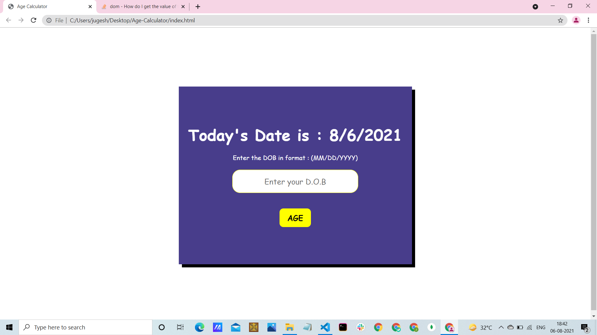
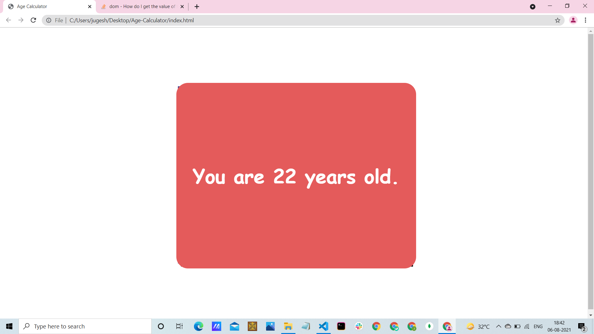

# Welcome 🖐 to the Age Calculator
This is a simple JavaScript program that calculates your age based on your birth year. It takes your birth year as input and calculates your current age by subtracting the birth year from the current year.

## Notes

- The program uses the current year to calculate your age, so it's important to have the correct date set on your system.
- The birth year should be entered as a four-digit integer (e.g., 1990).
- The program assumes that the user provides a valid birth year. Additional input validation can be implemented as per your requirements.

## Default view



## 💻Tech Stack
<br>


<br>

### How to use:

---

- Download or clone the repository

```
git clone https://github.com/Ayushparikh-code/Web-dev-mini-projects.git
```

- Go to the directory
- Run the index.html file
- Enter your DOB and find age..

<br>

## Happy Coding!
Feel free to modify and customize the program according to your needs.
## Example

Here's an example of how the program works:

Enter your birth year: 1990
Your age is: 33
