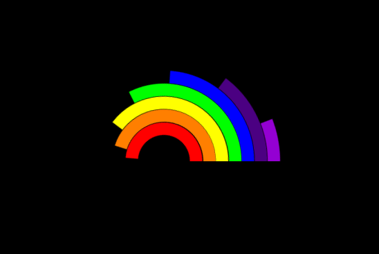

### Animated-Rainbow

It's a simple animated Rainbow without using Javascript..


### Used Technologies
  * HTML5
  * CSS3
  


#### Steps to Use:

---

- Download or clone the repository

```
git clone https://github.com/VaibhavSuryavanshi93/Web-dev-mini-projects.git
```

- Go to the directory
- Run the Rainbow.html file


## Screenshots 


