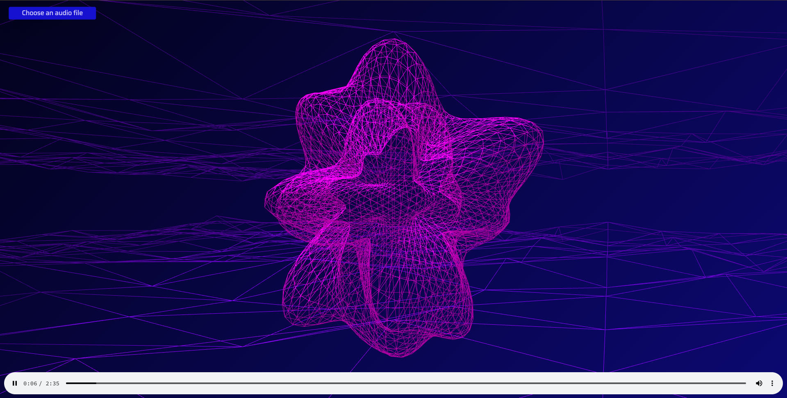
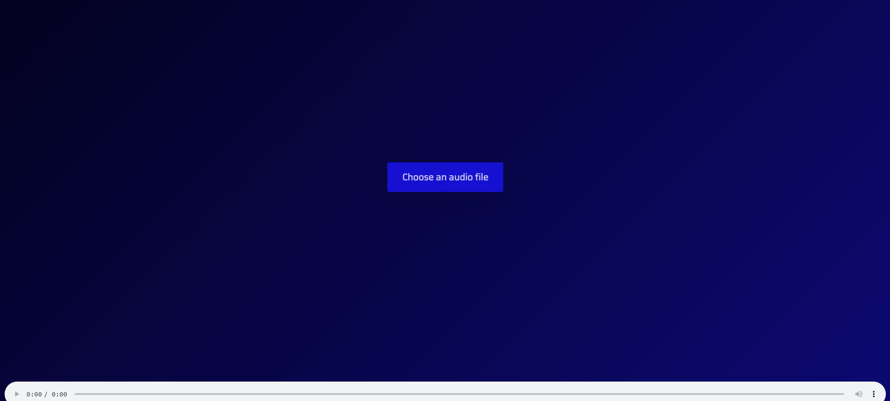

# Audio Visualization with three.js

This project demonstrates audio visualization using the powerful 3D graphics library, three.js. The visualization reacts to audio input, creating a dynamic and engaging visual experience.


Here is the look!
## Table of Contents
- [Introduction](#introduction)
- [Features](#features)
- [Installation](#installation)
- [Usage](#usage)
- [Files](#files)


## Introduction
Audio Visualization with three.js is a mini-project aimed at showcasing the capabilities of three.js in creating interactive and visually appealing audio visualizations.

## Features
- Real-time audio analysis
- Dynamic 3D visualizations
- Interactive controls

## Installation
To get started, clone the repository and open the `index.html` file in your browser.

```bash
git clone https://github.com/Ayushparikh-code/Web-dev-mini-projects.git
cd Web-dev-mini-projects/audio-visualization-threejs
```

## Usage
1. Open `index.html` in your preferred web browser.
2. Play an audio file to see the visualization in action.

## Files
- `index.html`: The main HTML file.
- `style.css`: The CSS file for styling.
- `script.js`: The JavaScript file containing the three.js logic.


