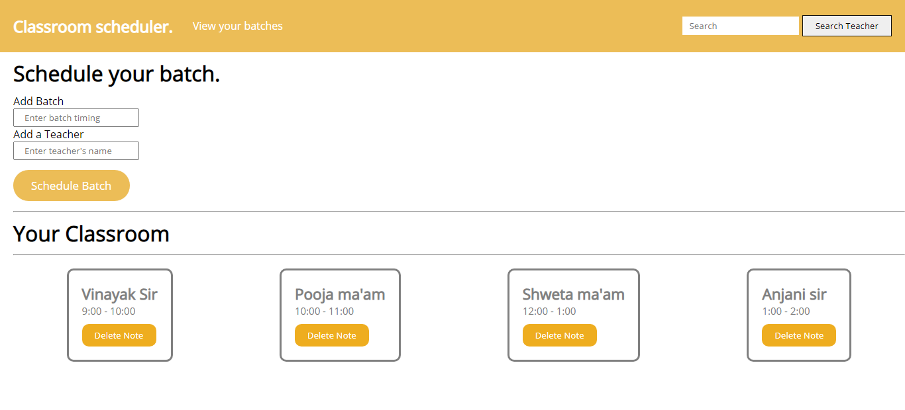

<h1>Classroom Website 👩‍🏫</h1>

<p>A website that lets you write about all your classes at one place. You can also search by typing the name of the teacher if you have so many classes to take.</p>

<h3>Used Technologies</h3>
<ul>
  <li>HTML5</li>
  <li>CSS3</li>
  <li>JavaScript</li>
</ul>


#### Steps to Use:
---

- Download or clone the repository
```
git clone https://github.com/Ayushparikh-code/Web-dev-mini-projects.git
```
- Go to the directory
- Run the index.html file
- Schedule your new batch.
- Add more and more batches.


<h3> ScreenShots </h3>  

