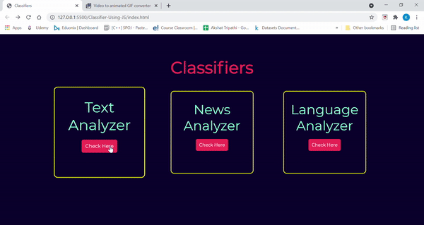

# Classifiers using JS

## About The Project
Building three different classifiers with the help of API.

1. Text Analyzer

Detect Sentiments in the text. This is a generic sentiment analysis classifier for texts in English. It will classify into 3 different categories: Positive, Negative & Neutral.

2. News Analyzer

Classify News articles by the topic such as Politics, Sports and many more.

3. Language Analyzer

Detect language in text. I will detect langauge from 49 different languages arranged in language families.

## Tech Stacks Used


## API Used

Visit Website: https://app.monkeylearn.com/

`For Text Analyzer` : https://api.monkeylearn.com/v3/classifiers/cl_pi3C7JiL/classify/

`For News Analyzer` : https://api.monkeylearn.com/v3/classifiers/cl_WDyr2Q4F/classify/

`For Language Analyzer` : https://api.monkeylearn.com/v3/classifiers/cl_Vay9jh28/classify/


## How to use Project


- Download or clone the repository

```
git clone https://github.com/Ayushparikh-code/Web-dev-mini-projects.git
```

- Go to the directory
- Run the index.html file
- Navigate to different classifers

## Screenshots


After clicking on Text Analyzer button, the UI looks like:


After clicking on News Analyzer button, the UI looks like:


After clicking on Language Analyzer button, the UI looks like:


## Live Demo


