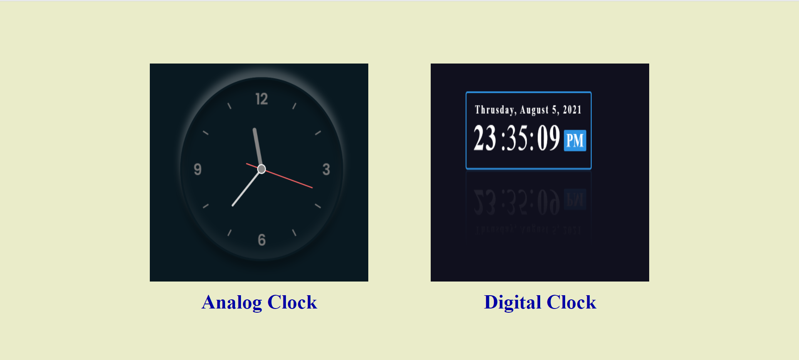
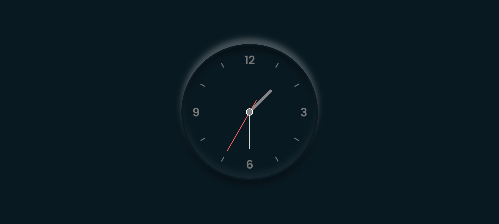
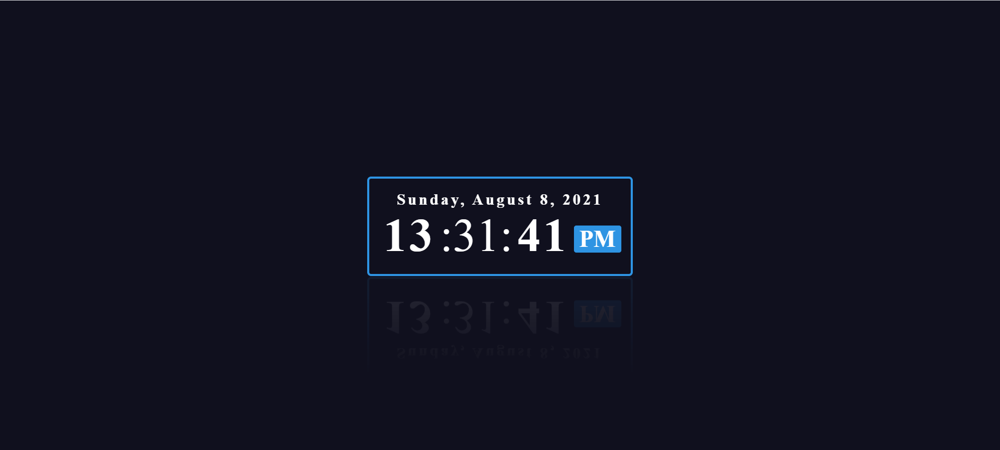

# Clock - Digital & Analog Clock  :clock3: 

## About the Project
This project combines two clocks - Digital Clock &Analog Clock

Digital Clock -> This clock includes Date (Day, Month, Year), Time (Hours, Minutes, Seconds) and Period (AM/PM). The clock is in 24 hours format.

Analog Clock -> It is a circular faced clock with the numbers one to twelve and three hands, shorter one to measure hours , longer one to measure minutes and red one for seconds.

## Tech Stacks Used


## How to use Project


- Download or clone the repository

```
git clone https://github.com/Ayushparikh-code/Web-dev-mini-projects.git
```

- Go to the directory
- Run the index.html file
- Click on the Analog Clock image, analog clock will appear.
- or Click on the Digital Clock image, digital clock will appear.

## Screenshots

Initially, the UI looks like:



After clicking on Analog Clock image, move to analog clock page:



After clicking on Digital Clock image, move to digital clock page:



## Live Demo

