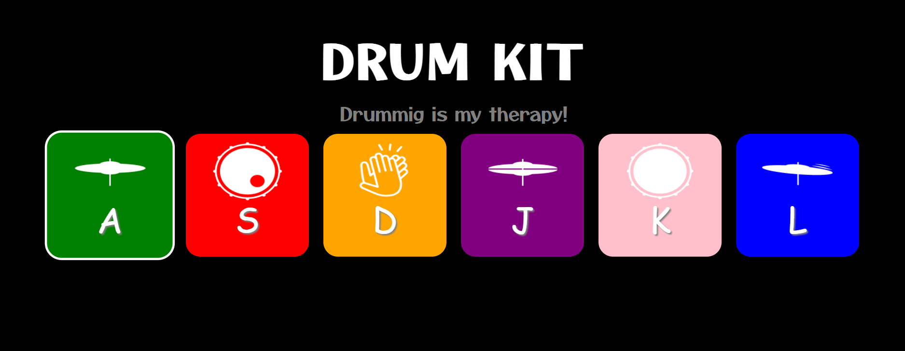

<h1>DRUM KIT</h1>

<p>Basic Drum Kit made using HTML, CSS, and JavaScript .</p>

### DRUM :

<p>This web app allows you to make your own music with all the beats that are present in the app. You can click on the alphabets or the images that are present on the screen and enjoy the beats. You can also use your keyboard keys to make the music.</p>

<h3>Used Technologies</h3>
<ul>
  <li>HTML5</li>
  <li>CSS3</li>
  <li>JavaScript</li>
</ul>

#### Steps to Use:

---

- Download or clone the repository

```
git clone https://github.com/Ayushparikh-code/Web-dev-mini-projects.git
```

- Go to the directory
- Run the index.html file
- Start Using The DRUM

<h3>ScreenShots</h3>
<br>


