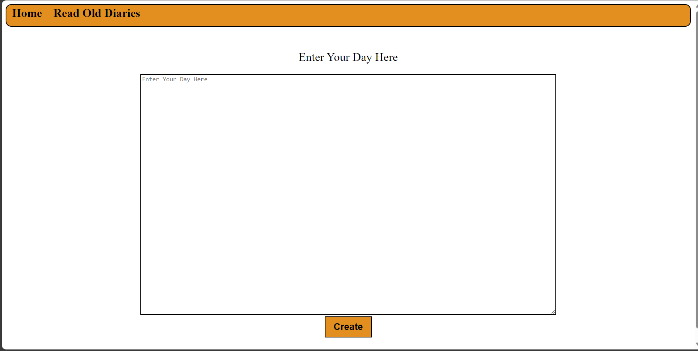

<h1>Diary Writing Website</h1>

<p>Simple Diary writing website written in HTML, CSS, and JavaScript .</p>

### Use of the Project:

<p>Diary writing websites are helpful for writing diaries and it will keep the record of old diaries that are written by user</p>


<h3>Used Technologies</h3>
<ul>
  <li>HTML</li>
  <li>CSS</li>
  <li>JavaScript</li>
</ul>

#### Steps to Use:

---

- Download or clone the repository

```
git clone https://github.com/Ayushparikh-code/Web-dev-mini-projects.git
```

- Go to the directory
- Run the diary.html file
- Write about your day in the Home section

<h3> ScreenShots </h3>  

<br>
