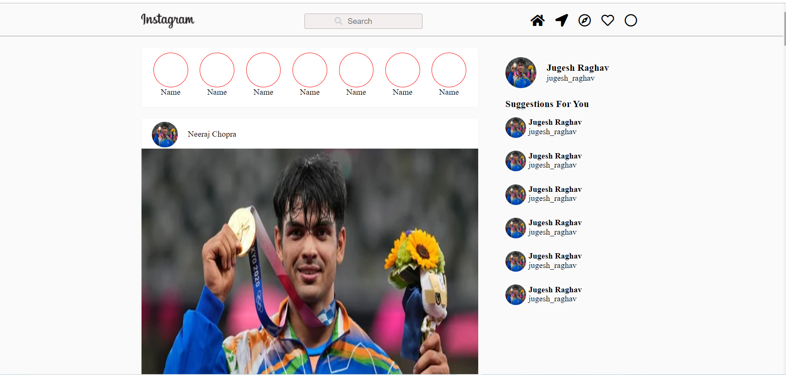

# Welcome 🖐 to Insta Clone
It is a simple clone of instagram front page using react.

## Desktop view


## 💻Tech Stack
<br>


<br>

### How to get the clone on your local machine:

---

- Download or clone the repository

```
git clone https://github.com/Ayushparikh-code/Web-dev-mini-projects.git
```

- Go to the directory
- open the terminal 
- run the following command to install node modules
```
npm install
```
- then run the following command to start the server
```
npm start
```


## Happy Coding!