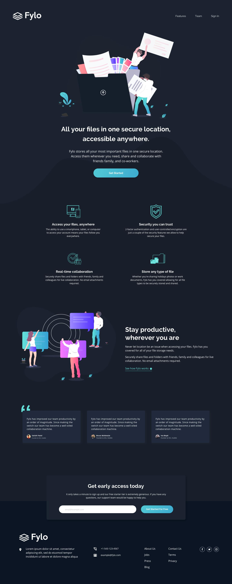

# Fylo Dark Theme Landing Page

## Table of contents

- [Overview](#overview)
  - [The objective](#the-objective)
  - [Screenshot](#screenshot)
  - [Built with](#built-with)
  - [Live website](#live-website)
  - [How to use](#how-to-use)

## Overview

- Front end landing page created using HTML/CSS. Built to enhance web-responsive
skills by using CSS layout tools (Grid or Flexbox).

### The objective

- Use your HTML and CSS skills to create a static landing page. Consider creating the components using CSS Grid or Flexbox to ensure the page is responsive.

### Screenshot

### Built with

- HTML
- CSS

### Live website

- [Visit Live Website](https://mitp7.github.io/Fylo-LandingPage/)

### How to use

- Clone this repository.
- Right click on the `index.html` file.
- Click on `copy path` and paste it in your browser.
