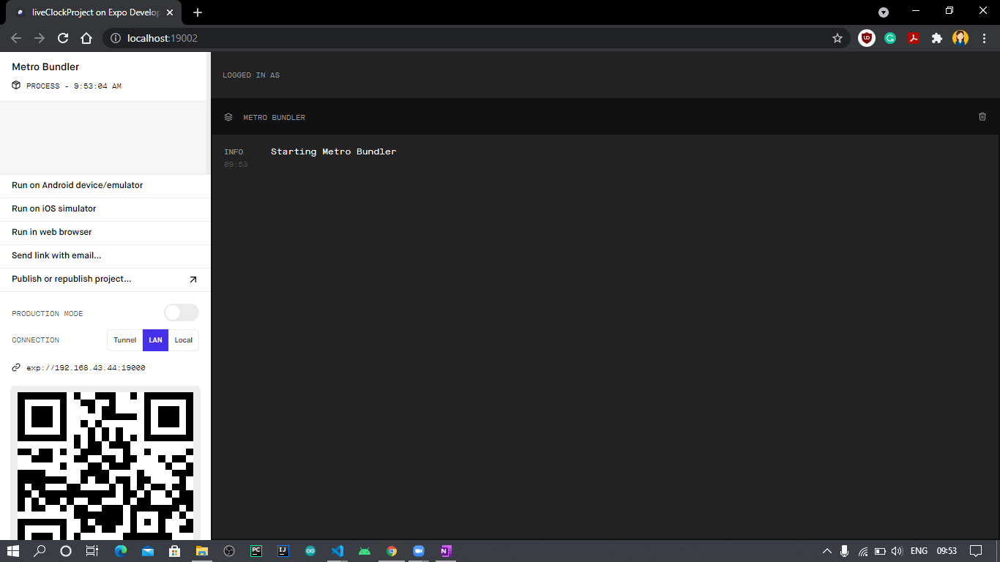
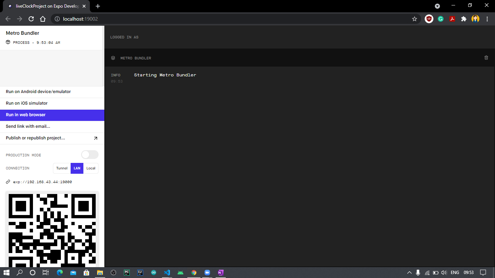
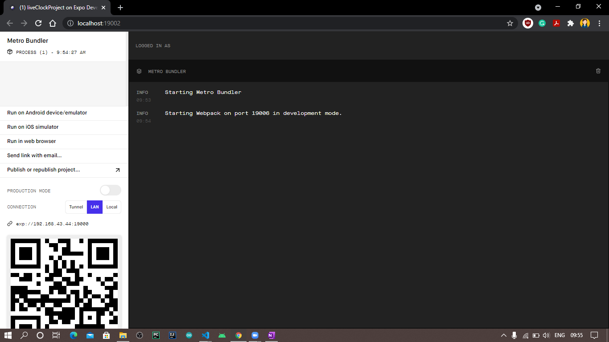
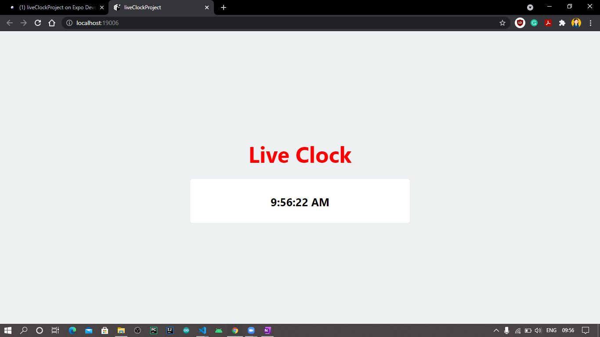

# Live Clock
A Live Clock Project which shows current time always with appropriate abbreviations AM or PM.

# Use of Project
A beginner-friendly project to get started with web development, especially React-Native. 

# Stack Used
- JavaScript
- React-Native

# Set up required to run
- Pre-requisite -> Install node in your system and add it to environment path variable.
- Install expo-cli using command:
```
npm install -g expo-cli
```
- Now, clone this repo.
```
git clone https://github.com/Ayushparikh-code/Web-dev-mini-projects  
```
- Move to project directory.
- In your IDE terminal, run command:
```
npm start
```
- On the new window that will open in the browser, click on the preferred option like web browser, android emulator, etc.
- Wait for sometime, the project will open and run in another tab of browser.

# Screenshots
- On running "npm start" command, a "Expo Developer Tools" window will open in the browser.


- On clicking "Run in Web Browser", project will start initializing.



- A new tab will open which will show the live clock.

