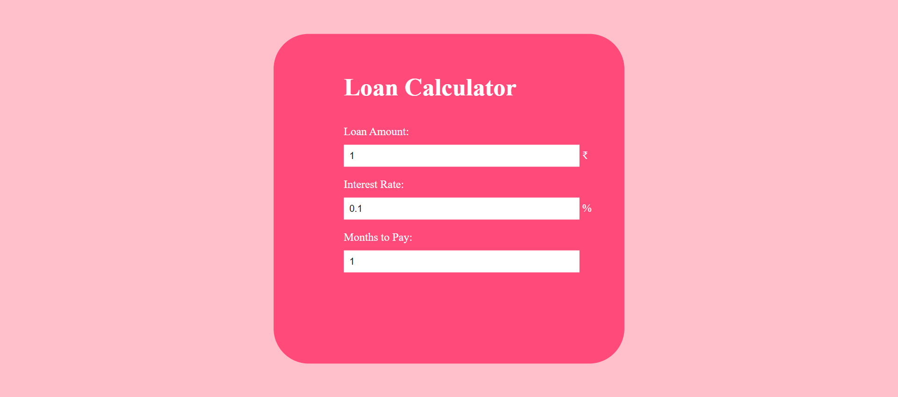
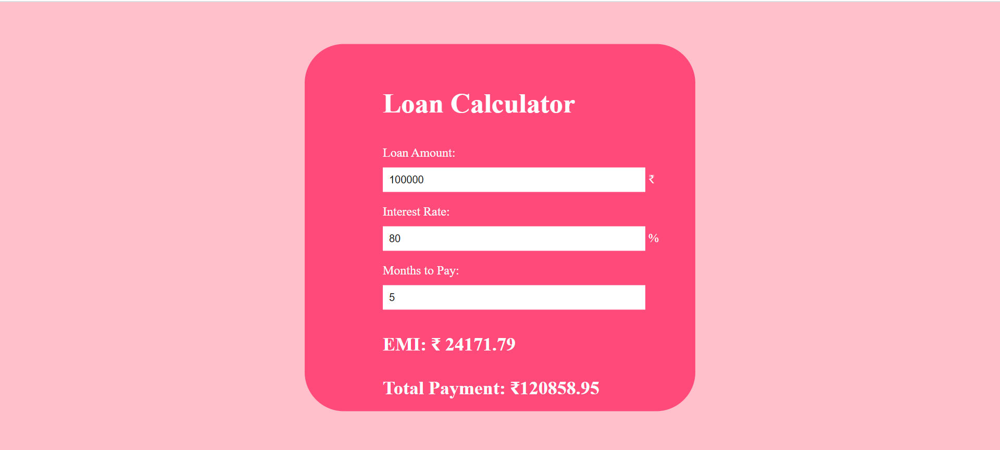
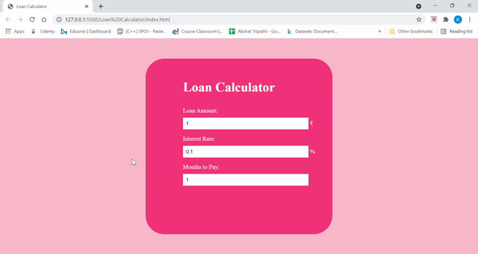

# Loan Calculator using JS

## About the Project
<p>User enters three values - Loan Amount, interest and number of months. After that, EMI and total payment will be displayed on the screen </p>

## Use of the Project:

<p>To Calculates the Loan EMI (Equated Monthly Installment)</p>

## Tech Stacks Used


## Steps to Use:

---

- Download or clone the repository

```
git clone https://github.com/Ayushparikh-code/Web-dev-mini-projects.git
```

- Go to the directory
- Run the index.html file
- Start Calculating!

## Screenshots

Initially, the calculator have some default values:



After entering the values, UI looks like:



## Live Demo

