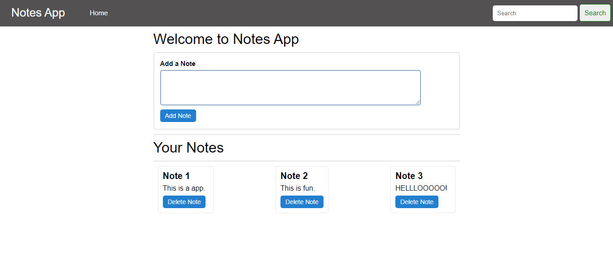

# Notes Keeping App 📝

*This app allows you to create your own notes and save them in the local storgae which will not be deleted even when you reload the page. It will be deleted once you click on the delete note button.*

> Used Technologies:
- HTML
- CSS
- JAVASCRIPT

### Steps to use: 

- Download or clone the repositorY
`
git clone https://github.com/Ayushparikh-code/Web-dev-mini-projects.git
`

- Go to the directory
- Run the index.html file
- Start writing!

