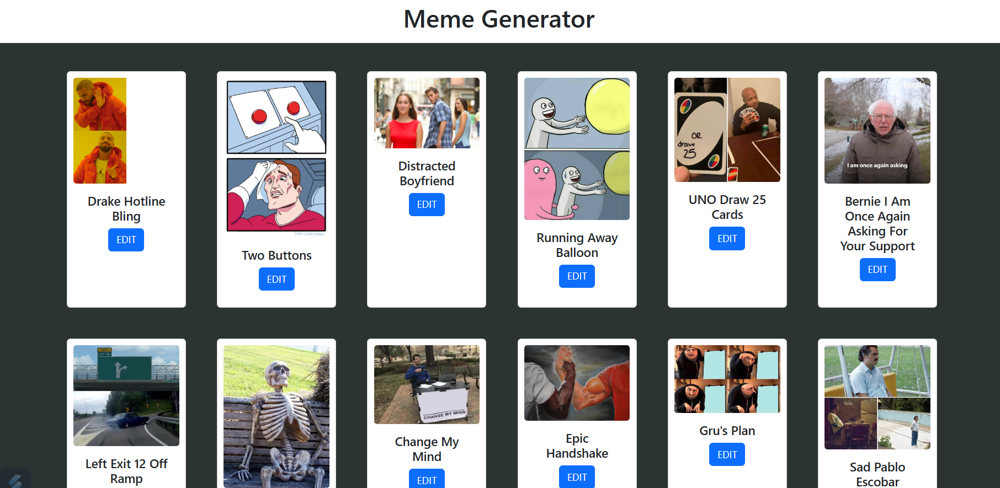
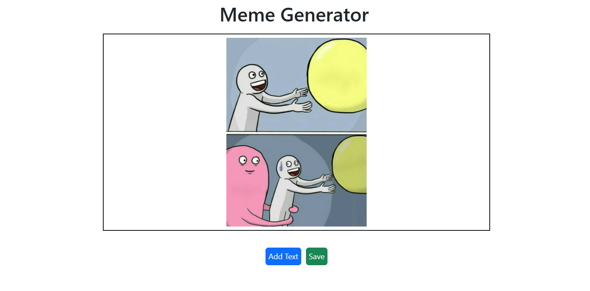
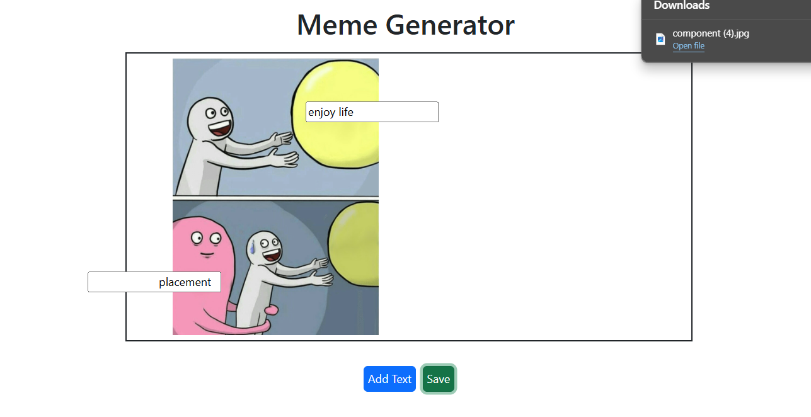

Web Development Mini-Project: Meme Generator

This project involves developing a website that allows users to create and customize memes. The application includes the following features:

- Utilize meme templates from an API for meme creation.
- Edit and personalize text on meme templates.
- Download the customized meme as a PDF to your device.

