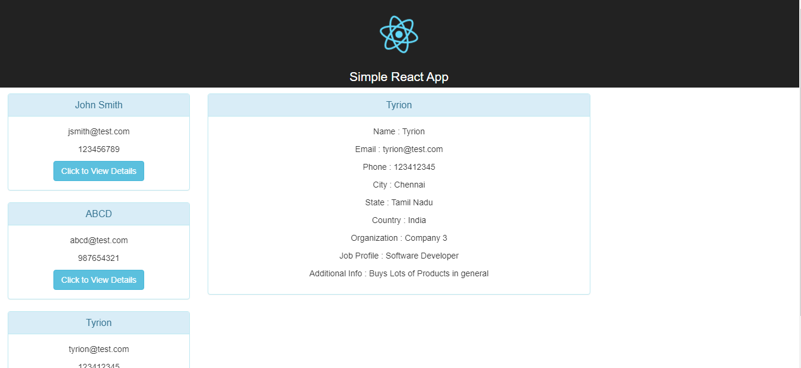

# Simple React JS Project
This Project is a Simple ReactJS Project which demonstrates the following
1. Creating a Component in React
2. Making HTTP calls
3. Communicating between parent and child component
4. Using Bootstrap along with React
5. Using Basic Routing in React

## Prerequisites

### Install Node JS
Refer to https://nodejs.org/en/ to install nodejs

### Install create-react-app
Install create-react-app npm package globally. This will help to easily run the project and also build the source files easily. Use the following command to install create-react-app

```bash
npm install -g create-react-app
```

## Cloning and Running the Application in local

Clone the project into local

Install all the npm packages. Go into the project folder and type the following command to install all npm packages

```bash
npm install
```

In order to run the application Type the following command

```bash
npm start
```

The Application Runs on **localhost:3000**

## Screenshot

