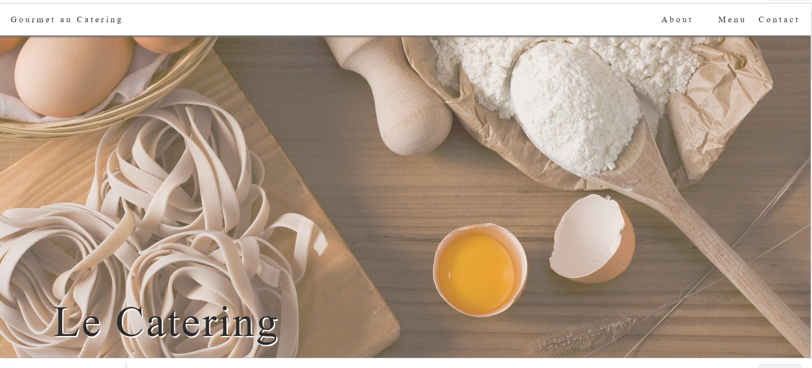
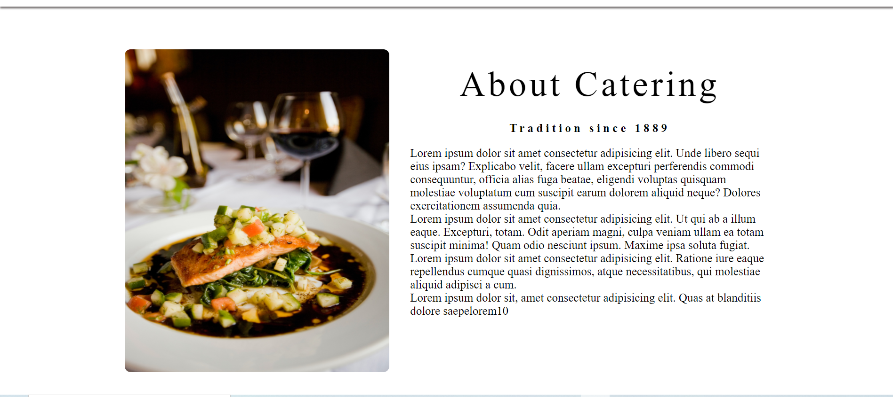
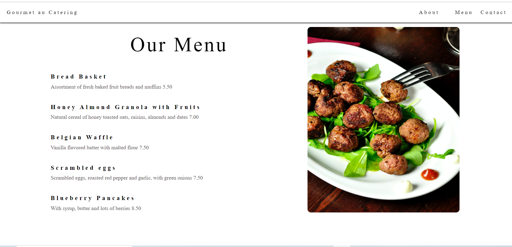
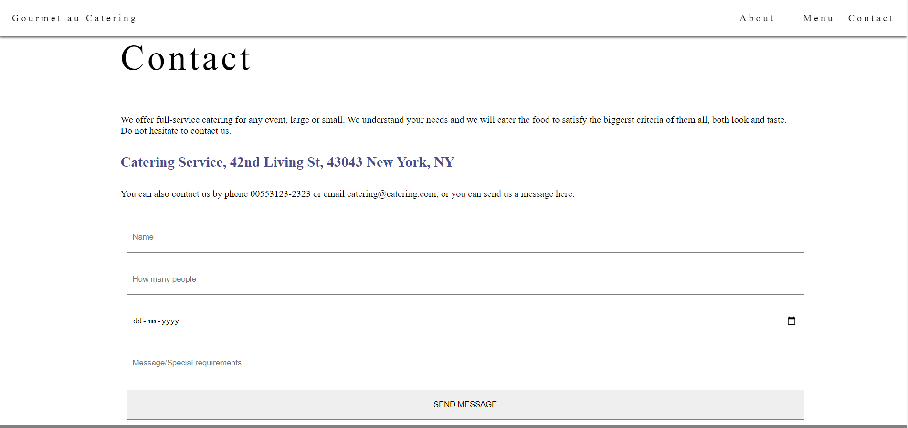

# Welcome 🖐 to the Restaurant Website
It is a one pager Restaurant Website with an integrated databse.

## Default view of the website
HOMEPAGE


ABOUT


MENU


CONTACT


## 💻Tech Stack
<br>


<br>

### Pre-requisites to successfully clone the website

1. Install Node js

2. Install mongoDB Compass or not installing will be ok.

### How to get the website on your local machine:

---

- Download or clone the repository

```
git clone https://github.com/Ayushparikh-code/Web-dev-mini-projects.git
```

- Go to the directory
```
cd Restaurant-website
````

- open the terminal 
```
ctrl+shift+`
```

- run the following command in the terminal.
```
npm install
```

- go to any browser and type the following in the search bar
```
localhost:3000
```

<br>


## Happy Coding!
