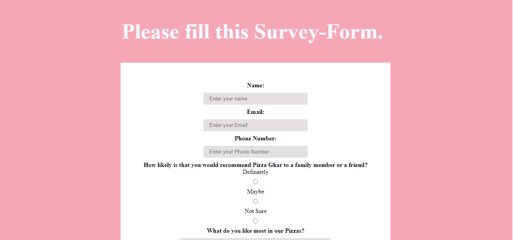
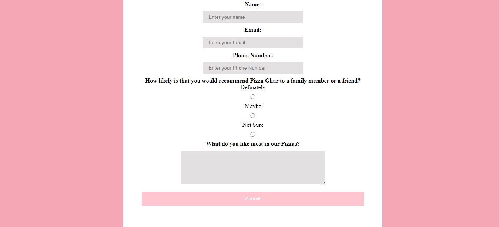

# Welcome 🖐 to the SURVEY FORM
It is a simple Survey Form. We can use this form to take feedback from the customers and use it for the betterment.


## 💻Tech Stack
<br>


<br>


### How to get the form on your local machine:

---

- Download or clone the repository

```
git clone https://github.com/Ayushparikh-code/Web-dev-mini-projects.git
```

- Go to the directory
- Open Survey Form folder
- Open the terminal and run 
```
node app.js
```
- Open *localhost:3000* in your browser.

*** 
###Remember: 
If you are using node then you need to reload your server everytime you make changes in your file. Otherwise if you have nodemon installed, you can use nodemon. 
***

<br>

##Screenshots


<br>


<br>


## Happy Coding!