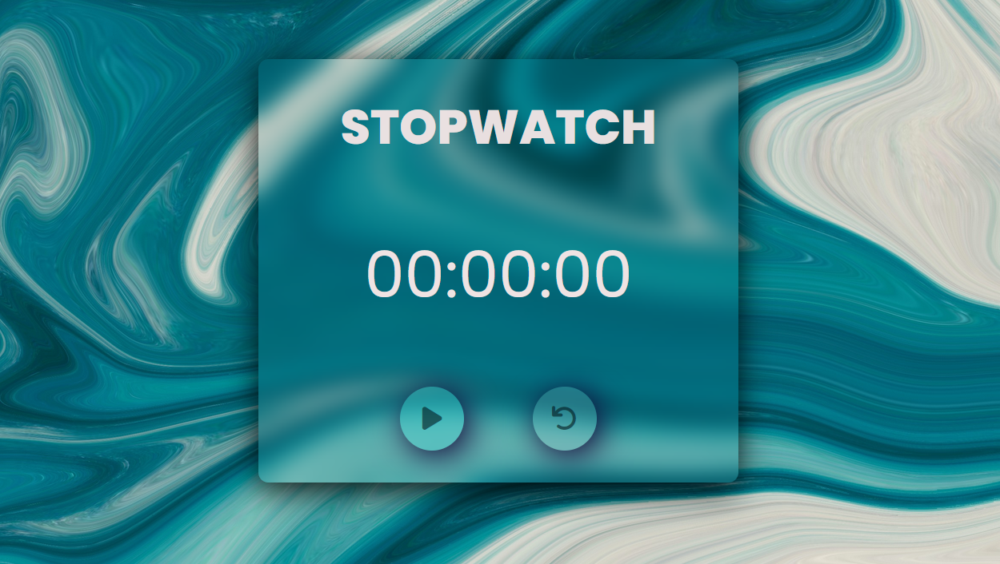

#  StopWatch 

A glassmorphic themed stopwatch 


## Use of the Project:
User can start the stopwatch to track time from start button and use the reset button to set the time to zero to restart tracking.

### Used Technologies
HTML5
CSS3
JavaScript

# Steps to Use:
- Download or clone the repository:

```git clone https://github.com/Ayushparikh-code/Web-dev-mini-projects.git```

- Go to the directory   
- Run the index.html file     
- Start Checking!


# ScreenShot

