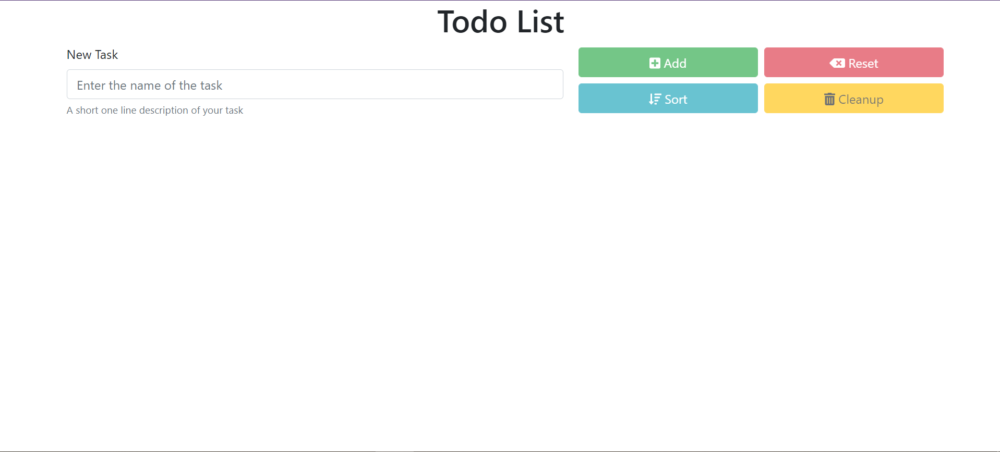
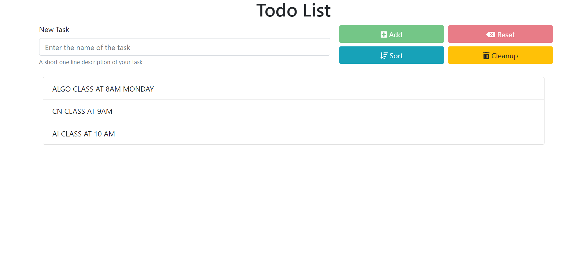
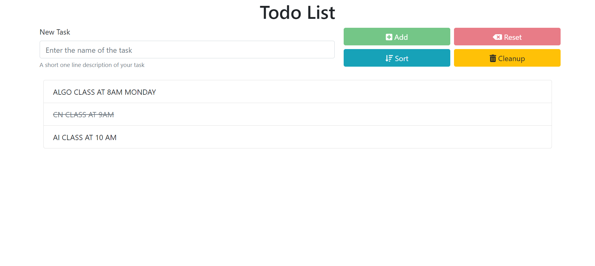

<h1>TO-DO List</h1>

<p>Simple TO-DO List written in HTML, CSS, and JavaScript .</p>

### Use of the Project:

<p>TODO List are the lists that we generally use to maintain our day to day tasks or list of everything that we have to do, with the most important tasks at the top of the list, and the least important tasks at the bottom. It is helpful in planning our daily schedules.</p>


<h3>Used Technologies</h3>
<ul>
  <li>HTML5</li>
  <li>CSS3</li>
  <li>JavaScript</li>
</ul>

#### Steps to Use:

---

- Download or clone the repository

```
git clone https://github.com/Ayushparikh-code/Web-dev-mini-projects.git
```

- Go to the directory
- Run the index.html file
- Add your tasks According to your wish

<h3> ScreenShots </h3> 
 
 <br>
 <ul>
  <li>To add the Task,Write the Task in the box and click on Add Button<br>
    </li>
   <li>If you have completed the task,click on the task to strike-out<br>
    </li>
     <li>To Remove the completed Task,First click on the task to strike-out and then Click on Cleanup<br>
    </li>
</ul>

