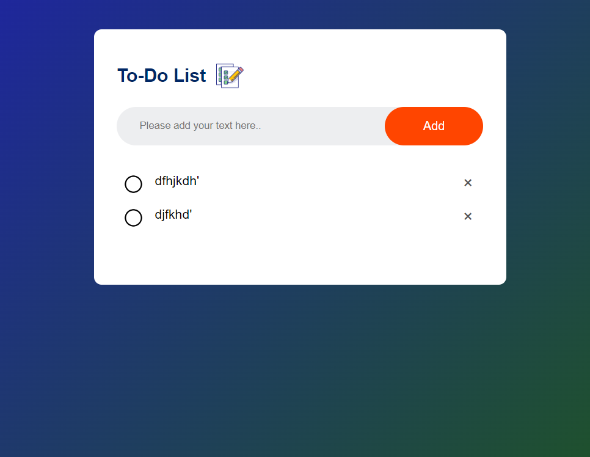

# To-do
A to-do list is a concise tool for organizing tasks, prioritizing work, and boosting productivity by providing a clear roadmap for completing activities.

### Use of the Project:
A to-do project succinctly organizes tasks, streamlining prioritization and workflow for efficient project management.

### Used Technologies
  * HTML5
  * CSS3
  * JavaScript


#### Steps to Use:

---

- Download or clone the repository

```
git clone https://github.com/VaibhavSuryavanshi93/To-do
```

- Go to the directory
- Run the to-do file
- Start Doing..!!
--- 

## Screenshots 


