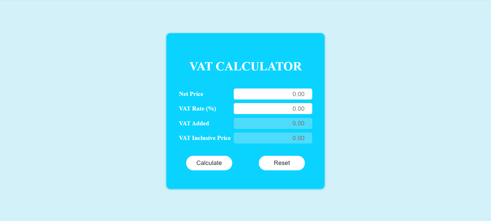

# VAT Calculator

## About the Project
Calculates the Value Added Tax (VAT) on products or services 

## Use of the Project:

<p>This calculator has two input fields, one for amount and another one for vat rate and two output fields , one is for VAT amount and another one for VAT Inclusive amount.</p>

## Tech Stacks Used


### Steps to Use:

---

- Download or clone the repository

```
git clone https://github.com/Ayushparikh-code/Web-dev-mini-projects.git
```

- Go to the directory
- Run the index.html file
- Start Calculating!

## Screenshot



## Live Demo

