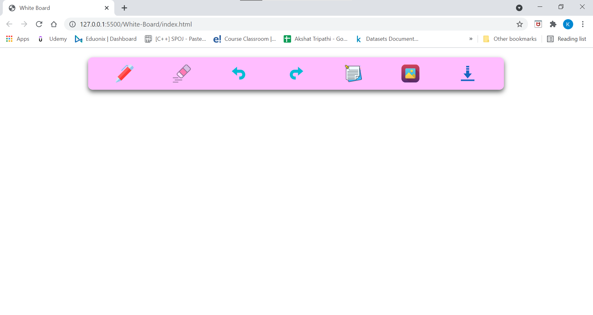

# Digital White Board

## About the Project
It is a simple digital white board built using HTML, CSS and Javascript. It has multiple features : 

1. Pen with different sizes & colors
2. Eraser with different sizes
3. Undo
4. Redo
5. Sticky Notes
6. Image Upload
7. Download


## Tech Stack Used


## How to use the Project

- Download or clone the repository

```
git clone https://github.com/Ayushparikh-code/Web-dev-mini-projects.git
```

- Go to the directory
- Run the index.html file
- Start playing with board, explore different features

## Screenshots



## Live Demo


