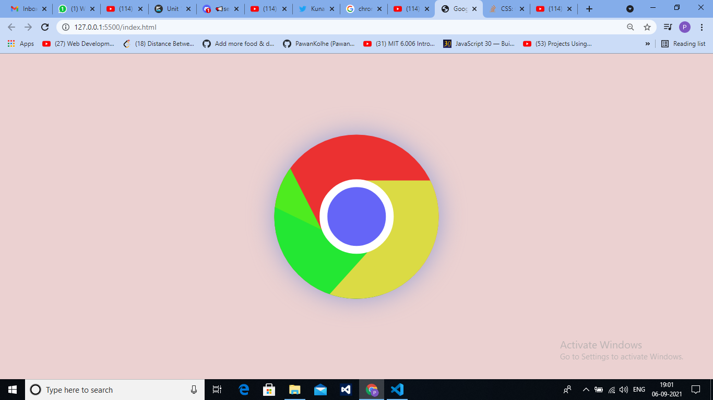

# Welcome 🖐 to Neon-Light based icons
It is a simple and resonsive Website made using bootstrap.

## Desktop View



## 💻Tech Stack
<br>


<br>

### How to use:

---

- Download or clone the repository

```
git clone https://github.com/Ayushparikh-code/Web-dev-mini-projects.git
```

- Go to the directory
- Run the index.html file


<br>

## Coding is fun, So enjoy :) 