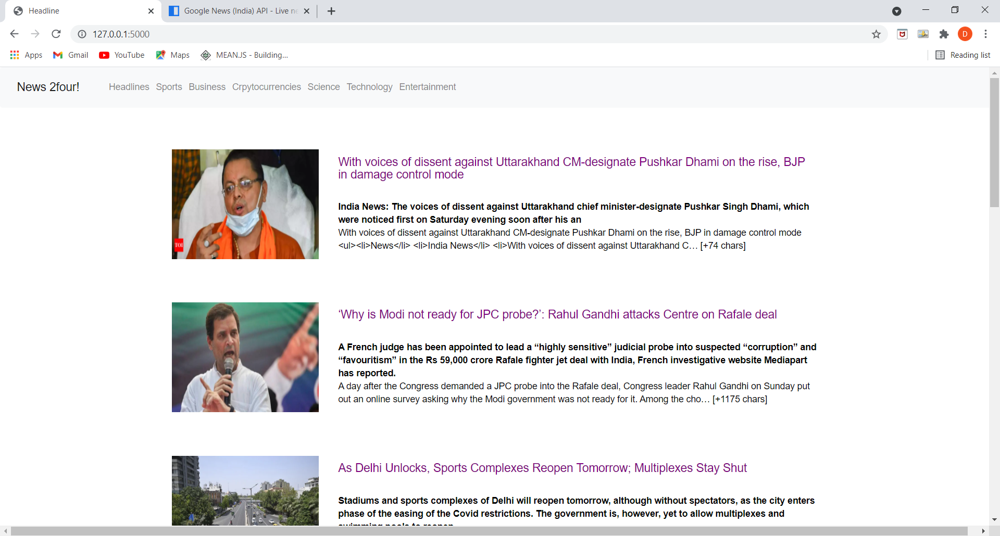
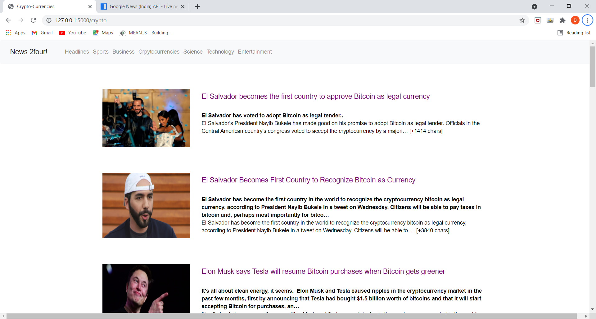
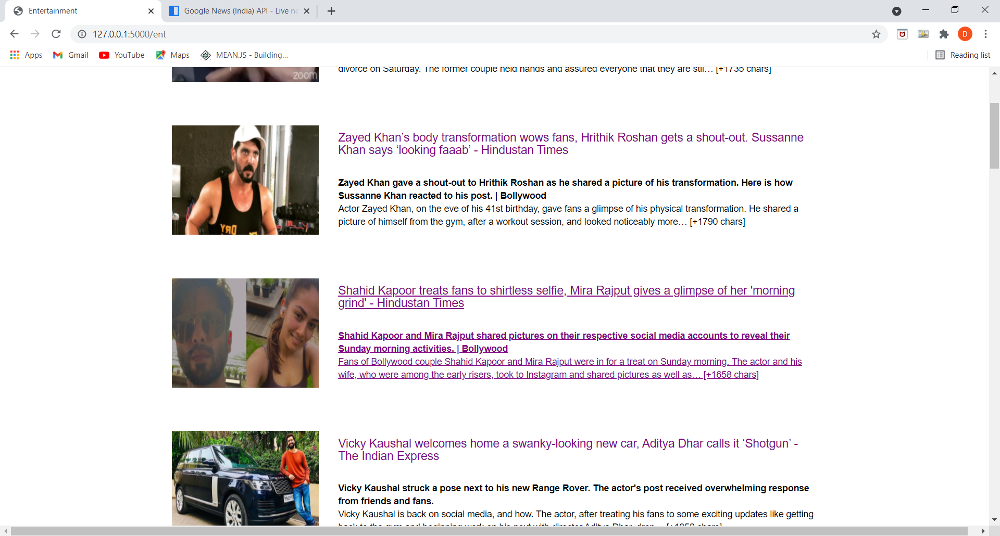

<h1 align="center">Flask-mini-news-web-app</h1> 

<br>
<div align="center">

<b>Design-Fetch-Request-Deploy<b>
<p>
```terminal
  pip install requirements.txt
```


Go to google-news-India-api and <a href="https://newsapi.org/s/google-news-in-api">get</a> your apikey


Add your key to api_key variable

and here you go....


```terminal
python app.py
```

Go to port 5000 and .....
  
  
  
  

</p>
