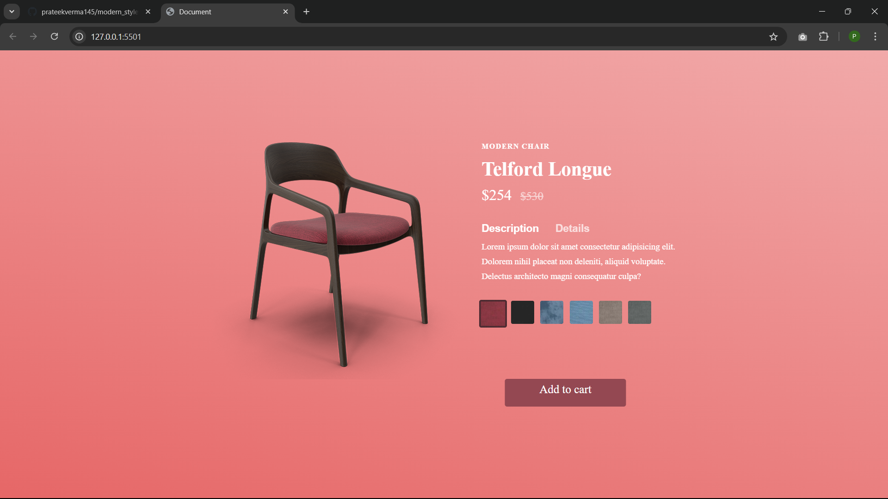
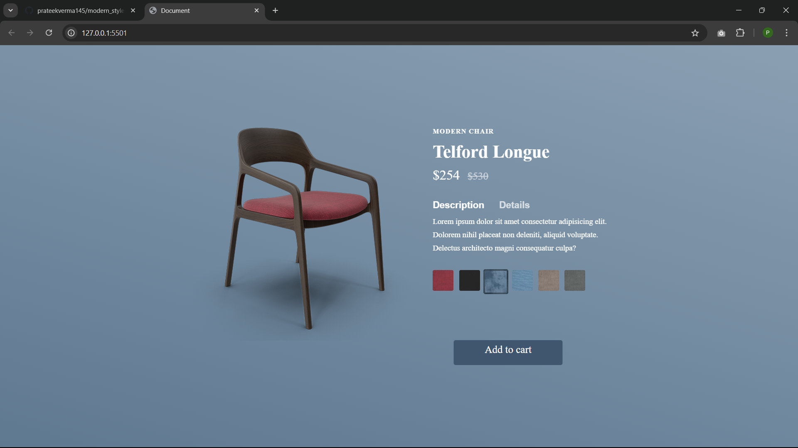

# Modern Chair Product Page

This is a fully functional product page for a modern chair, built with **HTML**, **CSS**, and **JavaScript**. The page features a visually appealing design and interactive elements to provide a seamless user experience.

 <!-- Replace with the actual path after uploading your screenshot -->

## Features

- Dynamic product details and pricing display.
- Interactive color selection for the product.
- Smooth animations and transitions for a better user experience.
- Fully responsive design, optimized for desktop and mobile.
- Functional "Add to Cart" button using JavaScript.

## Technologies Used

- **HTML5**: For the structure and content of the page.
- **CSS3**: For styling and layout.
- **JavaScript**: For interactive functionality.

## How to Use

1. Clone the repository:
2. Go live 

## screenshot 

